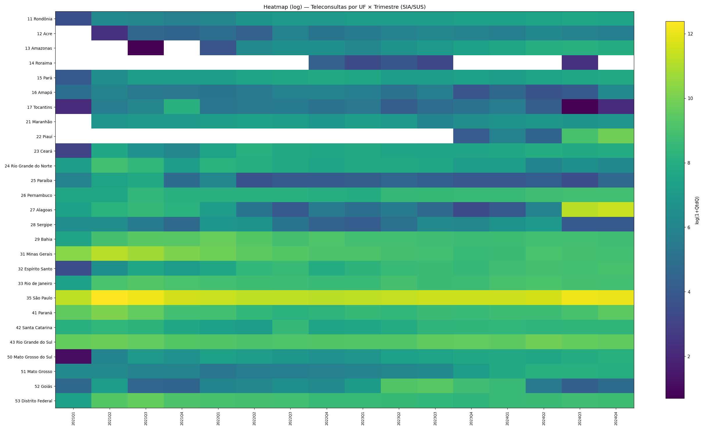
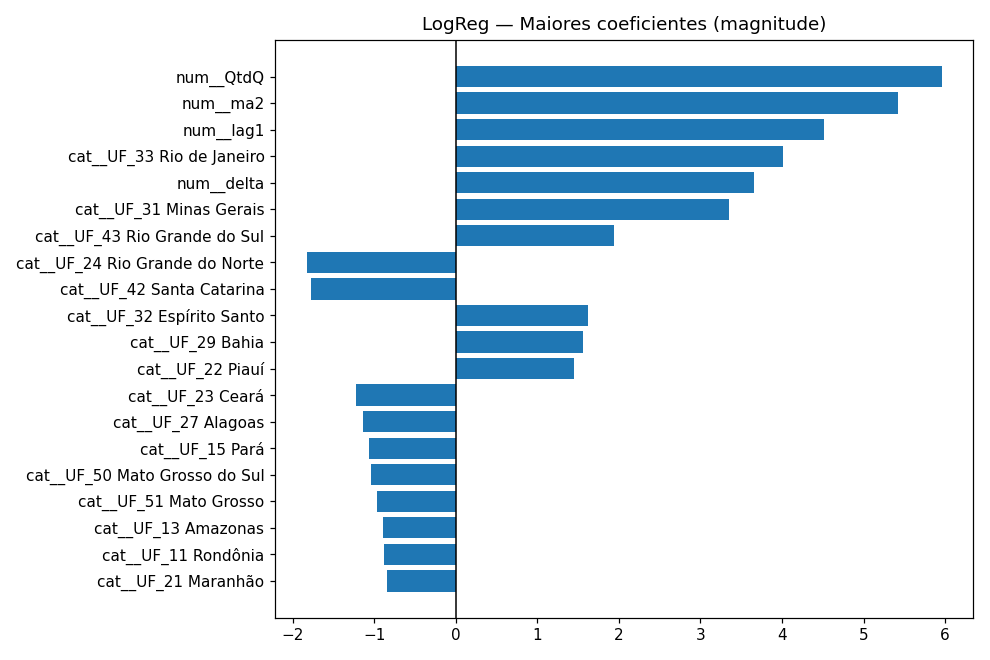

# 🩺 Classificador de Adoção de Telemedicina (Brasil · SIA/SUS)  
**Challenge FIAP 2025 – CarePlus**
**Alunos:**
**Pedro Chaves - RM553988**
**Enzzo Monteiro Barros Silva - RM552616**
**Enzo Barbeli - RM554272**
**Lucas Garcia - RM554070**
**Iago Diniz - RM553776**
**Felipe Santana - RM554259**

> **TL;DR:** Para lançar o app primeiro, apostaremos em **São Paulo** e **Rio de Janeiro** — são historicamente os maiores usuários de telemedicina e, no nosso modelo, têm **alta probabilidade** de ficar no **top-25%** de adoção no trimestre mais recente. Em seguida, **Minas Gerais** e **Rio Grande do Sul** aparecem como bons candidatos. ✅

---

## 🎯 Objetivo
Prever, por **UF × trimestre**, quem estará no **grupo de alta adoção** de teleconsulta (**top 25%** em cada trimestre). Isso guia **priorização de rollout** e **ações de marketing** do app de bem-estar.

## 🗂️ Dados
- **Fonte:** TABNET / **SIA-SUS** (produção ambulatorial), procedimentos de **teleconsulta**.  
- **Período útil:** **2021Q1 → 2024Q4** · **27 UFs** · **16** trimestres · **405** linhas (após agregação trimestral).  
- **Formato interno:** `UF`, `YearQuarter`, `QtdQ` (teleconsultas aprovadas no trimestre).

---

## 🧭 Roteiro dos Blocos (B1 → B10)

### **B1 — Leitura & saneamento (HTML/CSV)**
Extrai a tabela mesmo quando o TABNET foi salvo como **HTML** (limpa `<pre>`, `<table>`, cabeçalhos).  
Converte de **wide → long**: `UF`, `YearMonth`, `Qtd`.  
**Checagem:** UFs **27** · Meses **48** · Linhas **1164**.

### **B2 — Parse de datas & agregação trimestral**
Detecta `2021/Jan` e `Jan/2021`, cria `YearQuarter`/`q_index`.  
Agrega por trimestre: **soma** de `Qtd` → `QtdQ`.  
**Checagem:** UFs **27** · Trimestres **16** · Linhas **405**.

### **B3 — EDA (distribuição & heatmap)**
- Histograma de **log(1+QtdQ)** para cauda longa.  
- Heatmap **UF × Trimestre** (escala log).  
_Imagens:_ `outputs/dist_qtdq_log.png`, `outputs/heatmap_uf_trim.png`.



### **B4 — Definição do alvo**
**Alta = 1** se a UF está no **top-25%** de `QtdQ` **dentro do trimestre** (fair no tempo).  
**Balanceamento:** baixa **73,09%** · alta **26,91%**.

### **B5 — Features (tempo + sazonalidade)**
`lag1`, `delta`, `ma2`, `q_sin/q_cos`, nível `QtdQ` e **dummies de UF**.  
**Forma final:** `X` **(378×9)** · `y` **(378)** · **15** trimestres.

### **B6 — Validação temporal**
Split temporal: **treino** até **2024Q3**, **teste** em **2024Q4**.  
Pré-processamento: `Median + StandardScaler` (num), `OneHot` (cat).  
`X_train (352×7)` · `X_test (26×7)`.

### **B7 — GridSearchCV · Regressão Logística**
- **Grid:** `penalty ∈ {L1, L2}`, `C ∈ {0.01, 0.1, 1, 10}`  
- **CV por grupos (trimestres)** no treino.

**Vencedor:** `L2, C=10` · **F1-CV 0,9024**  
**Teste (2024Q4):** **Acc 0,8846 | F1 0,8235 | Prec 0,7000 | Rec 1,0000 | AUC 0,9925**  
**Matriz:** `[[16, 3], [0, 7]]` → **não perdemos nenhuma UF “alta”** (recall 1,0).

### **B8 — Comparação (Gradient Boosting)**
`n_estimators=200, learning_rate=0.05, max_depth=2` · **F1-CV 0,8992**  
**Teste:** **Acc 0,8462 | F1 0,7778 | AUC 1,0000**  
> LogReg vence em **F1** e **interpretabilidade**; GB empata em **AUC**.

### **B9 — Interpretabilidade (LogReg)**
Top influências (|coef|): **`QtdQ`**, **`ma2`**, **`lag1`**, **`delta`** → o **momentum** recente importa muito.  
Entre UFs (One-Hot), **RJ** e **MG** aparecem com pesos positivos relevantes.  
_Imagem:_ `outputs/coef_logreg_top20.png`.



### **B10 — Artefatos & resumo**
- **Predições** do teste (**2024Q4**) por UF: `outputs/predicoes_2024Q4.csv`  
  (`UF, YearQuarter, y_true, proba_alta, classe_predita`)  
- **Métricas**: `outputs/metrics.json` (LogReg e GB)

---

## 📊 Principais resultados (2024Q4)

| Modelo | F1 (CV) | Acc (Teste) | F1 (Teste) | Precision | Recall | ROC-AUC |
|---|---:|---:|---:|---:|---:|---:|
| **LogReg (L2, C=10)** | **0.9024** | **0.8846** | **0.8235** | 0.7000 | **1.0000** | **0.9925** |
| Gradient Boosting | 0.8992 | 0.8462 | 0.7778 | — | — | **1.0000** |

> **Leitura rápida:** priorizamos **recall** (1,0) para **não perder UFs “altas”** na priorização de rollout; aceitamos alguns **falsos positivos** (precisão 0,70).

---

## 📌 Onde lançar primeiro?
- 🥇 **São Paulo** e **Rio de Janeiro**: maior histórico + **alta probabilidade** de **top-25%** no último trimestre.  
- 🥈 **Minas Gerais**, **Rio Grande do Sul**: também fortes candidatos, aparecem logo atrás.  
- 🔎 **Ranking completo**: veja `outputs/predicoes_2024Q4.csv` (coluna `proba_alta`).

---

## 🔍 O que o modelo “olha”?
- **Nível atual** (`QtdQ`) + **tendência recente** (`ma2`, `lag1`, `delta`).  
- **Sazonalidade** de trimestre (`q_sin/q_cos`).  
- **Efeito UF** (dummies) captura diferenças estruturais de base.

---

## ⚙️ Como reproduzir
1. Ajuste o caminho no início do notebook:  
   ```python
   PATH = r"C:\Users\pedro\OneDrive\Área de Trabalho\2GS2025\IA-CHALL\DATASET-BRASIL-SUS.csv"
2. Execute os blocos **B1 → B10**.
3. Artefatos/Imagens geradas aparecerão em ./outputs.

Dependências: **pandas, numpy, matplotlib, scikit-learn**.

## ⚠️ Observações & limites
- Os dados são **agregados por UF** (não por indivíduo) e refletem **produção do SUS**; podem existir **diferenças de registro** entre estados.
- A classe “**alta adoção**” é **relativa ao trimestre** (top-25% de `QtdQ`). Para metas absolutas, use um **limiar fixo** de volume.
- O modelo considera **tendência recente** (lag, média móvel, delta) e **sazonalidade**; choques de curto prazo (ex.: mudanças de política pública) podem afetar previsões.
- Resultados podem ser **ainda melhores** ao enriquecer o dataset com **variáveis demográficas/econômicas** (IBGE) e outros **indicadores regionais**.
- Como é um problema **temporal**, recomenda-se **re-treinar** periodicamente (ex.: a cada trimestre) e monitorar **drift**.

## ✅ Conclusão
**O classificador baseado em Regressão Logística (L2, C=10)** apresentou **F1 = 0,82** e **ROC-AUC = 0,99** no **trimestre de teste (2024Q4)**, com **recall = 1,0** — ideal para priorização de rollout (não perdemos UFs de “alta adoção”).  
**Recomendação prática:** iniciar o lançamento por **São Paulo** e **Rio de Janeiro**, seguidos de **Minas Gerais** e **Rio Grande do Sul**, acompanhando o restante dos estados via **probabilidade de alta** e atualizando o modelo **trimestralmente**.
